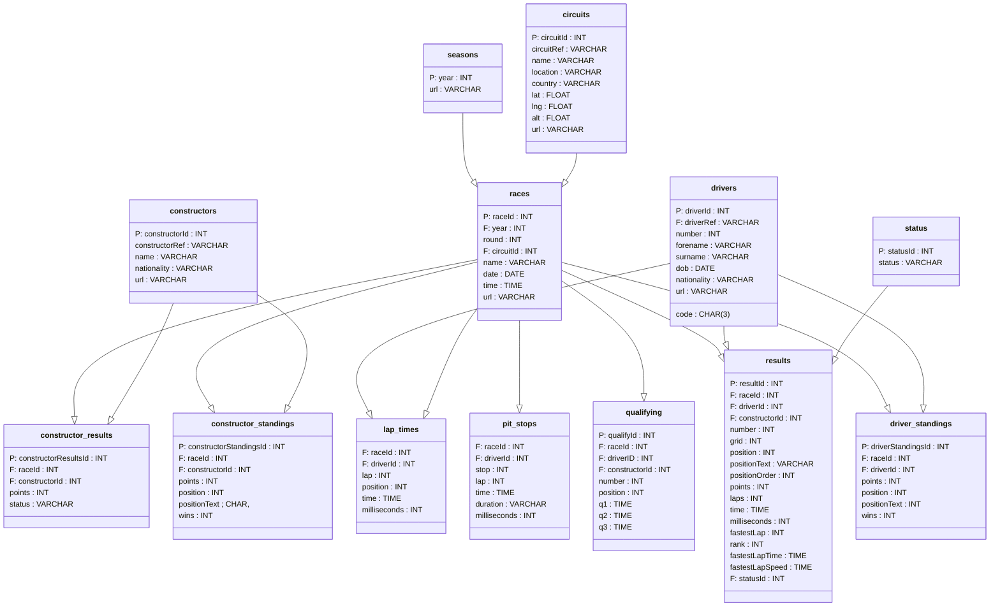

```mermaid
classDiagram

class circuits{

	P: circuitId : INT
	circuitRef : VARCHAR
	name : VARCHAR
	location : VARCHAR
	country : VARCHAR
	lat : FLOAT
	lng : FLOAT
	alt : FLOAT
	url : VARCHAR
}

class constructor_results {

	P: constructorResultsId : INT
	F: raceId : INT
	F: constructorId : INT
	points : INT
	status : VARCHAR
}

class constructor_standings {

	P: constructorStandingsId : INT
	F: raceId : INT
	F: constructorId : INT
	points : INT
	position : INT
    positionText ; CHAR,
	wins : INT
}

class constructors {

	P: constructorId : INT
	constructorRef : VARCHAR
	name : VARCHAR
	nationality : VARCHAR
	url : VARCHAR
}

class driver_standings {

	P: driverStandingsId : INT
	F: raceId : INT	
	F: driverId : INT
	points : INT
	position : INT
	positionText : INT
	wins : INT
}

class drivers {

	P: driverId : INT
	F: driverRef : VARCHAR
	number : INT
	code : CHAR(3)
	forename : VARCHAR
	surname : VARCHAR
	dob : DATE
	nationality : VARCHAR
	url : VARCHAR
}

class lap_times {

	F: raceId : INT
	F: driverId : INT
	lap : INT
	position : INT
	time : TIME
	milliseconds : INT
}

class pit_stops {

	F: raceId : INT
	F: driverId : INT
	stop : INT
	lap : INT
	time : TIME
	duration : VARCHAR
	milliseconds : INT
}
 
class qualifying {

	P: qualifyId : INT
	F: raceId : INT
	F: driverID : INT
	F: constructorId : INT
	number : INT
	position : INT
	q1 : TIME
	q2 : TIME
	q3 : TIME
}	

class races {

	P: raceId : INT
	F: year : INT
	round : INT
	F: circuitId : INT
	name : VARCHAR
	date : DATE
	time : TIME
	url : VARCHAR
}

class results{

	P: resultId : INT
	F: raceId : INT
	F: driverId : INT
	F: constructorId : INT
	number : INT
	grid : INT
	position : INT
	positionText : VARCHAR
	positionOrder : INT
	points : INT
	laps : INT
	time : TIME
	milliseconds : INT
	fastestLap : INT
	rank : INT
	fastestLapTime : TIME
	fastestLapSpeed : TIME
	F: statusId : INT
}

class seasons {

	P: year : INT
	url : VARCHAR
}

class status {

	P: statusId : INT
	status : VARCHAR
}

seasons --|> races
races --|> constructor_results
constructors --|> constructor_results

races --|> constructor_standings
constructors --|> constructor_standings 

drivers --|> lap_times
races --|> lap_times

races --|> pit_stops
races --|> qualifying

races  --|> results
drivers --|> results 
circuits --|> races

races --|> driver_standings
drivers --|> driver_standings

status --|> results

```